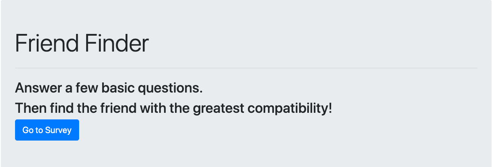

## FriendFinder

A web application that allow user to meet new friend with best match.

Friend Finder implements friend matching based on the user's responses to a ten question survey. The user responds to questions with values from 1 (Strongly Disagree) to 5 (Strongly Agree). When the survey is submitted, an existing user record closest to the current user's responses is found and returned. The closest set of user responses is defined as the set with the lowest absolute difference for all ten questions combined.

Heroku Link: https://glacial-meadow-29158.herokuapp.com/

## Instructions
1) Click "Go to Survey" Button.
2) Fill out survey. All sections are required.
3) Submit when finish.
4) Best match will pop-up in modal.

## Images

